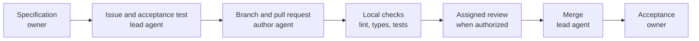

# Reply Assistant

[English](README.md) | [Русский](README.ru.md)

A local prototype for a sales or support manager. It takes a customer message and a short YAML knowledge base, then returns a draft reply and an upsell hint. The web page places the conversation beside the suggestion, checks and token usage.

Implementation and checks run in the selected local coding harness. GitHub stores the public source and task contracts. The owner decides what is built and accepts the finished work. The [working process](docs/how-this-repo-is-built.md) and [project knowledge](docs/knowledge/README.md) describe current roles and boundaries; historical cloud workflows do not authorize execution.

## Run locally

Requires [Python 3.12](https://docs.python.org/3.12/) and [uv](https://docs.astral.sh/uv/). The service uses [FastAPI](https://fastapi.tiangolo.com/) and [Pydantic](https://docs.pydantic.dev/), with plain HTML, CSS and JavaScript for the page. No database or frontend build is needed.

```bash
git clone https://github.com/hawkxdev/reply-assistant.git
cd reply-assistant
uv sync --locked
```

`uv` creates and manages the virtual environment; activation is unnecessary. Copy the settings template on macOS or Linux:

```bash
cp .env.example .env
```

Or in Windows PowerShell:

```powershell
Copy-Item .env.example .env
```

Fill the four required values in `.env` before starting. Keep the keys private; `.env` is excluded from Git. The three fallback values are optional and must be set together or left empty.

| Setting | Value |
|---|---|
| `REPLY_ASSISTANT_PROVIDER_API_KEY` | Your model provider's API key |
| `REPLY_ASSISTANT_PROVIDER_BASE_URL` | OpenAI-compatible base URL, for example `https://api.deepinfra.com/v1/openai` |
| `REPLY_ASSISTANT_PROVIDER_MODEL` | Model ID at that provider, for example `deepseek-ai/DeepSeek-V4.1-Flash` on DeepInfra |
| `REPLY_ASSISTANT_FALLBACK_PROVIDER_API_KEY` | Key of the secondary provider, empty for no fallback |
| `REPLY_ASSISTANT_FALLBACK_PROVIDER_BASE_URL` | Base URL of the secondary provider |
| `REPLY_ASSISTANT_FALLBACK_PROVIDER_MODEL` | Model ID at the secondary provider |
| `REPLY_ASSISTANT_FALLBACK_PROVIDER_JSON_MODE` | `true` (default) for JSON mode, `false` for a strict JSON schema |
| `REPLY_ASSISTANT_PROVIDER_MAX_OUTPUT_TOKENS` | Maximum tokens of one model answer, empty for no cap |
| `REPLY_ASSISTANT_KB_PATH` | `kb/example-en.yaml` or `kb/example-ru.yaml` |
| `REPLY_ASSISTANT_API_TOKEN` | Shared access token, empty to keep the demo open |

The provider must support JSON-schema structured output. Requests can incur provider charges. Start the service:

```bash
uv run reply-assistant
```

Open the [web page](http://127.0.0.1:8000/), [API documentation](http://127.0.0.1:8000/docs) or [health endpoint](http://127.0.0.1:8000/health). Replace the YAML file and restart to use another catalogue; the supplied examples contain fictional data.

## Try it

1. Enter a customer message and click **Receive**. The assistant panel shows the reply, product hint, knowledge-base match, checks and usage.
2. Review the draft and click **Insert into the chat**. This fills the manager's editor without sending anything; the editor grows so the first paragraph stays visible.
3. **Add to demo** places the manager's text in the local conversation only. The page is a mock, with an invented deal and opening conversation.

The customer message and knowledge base go to the configured model provider. The page does not send manager replies to a customer or CRM, and the service does not store the conversation.

## Reply workspace

The reply editor grows with its content within the available space and can also be resized by hand. **Enter** and **Shift+Enter** insert new lines, **Ctrl+Enter** (or **Cmd+Enter**) adds the finished reply to the demo transcript, and **Escape** leaves an enlarged editor. The draft, selection and scroll position survive every change of mode.

**Expand** temporarily hides the customer-message form and gives the editor more room; **Focus** gives it most of the workspace while the assistant panel stays reachable beside it. The customer-message field accepts pasted multiline text up to the 2000-character API limit. On wide screens the deal, conversation and assistant sit in three columns; medium widths move the compact deal card above them, and narrow screens stack the three areas. While the assistant is thinking, **Receive** is blocked so a question cannot be sent twice, and the next typed question waits in the field.

An API request in Bash:

```bash
curl http://127.0.0.1:8000/api/suggest \
  -H 'Content-Type: application/json' \
  -d '{"message":"How much is Zeolite Powder?"}'
```

## Manager workspace

The warm teal screen keeps a compact customer strip above the conversation/editor and assistant. Start with a customer question or choose an example to fill the input, then request a real model response. Examples do not submit automatically and contain no predefined answers. Insert the returned draft, edit it, and add it to the local demonstration conversation; no message is sent to an actual customer. Expand and Focus preserve the draft and selection, and Escape returns to the normal editor. Checks and technical usage can be disclosed separately, and a provider fallback stays visible in the usage summary even when collapsed.

The page embeds the Cyrillic-capable Onest font, licensed under the bundled [SIL Open Font License](src/reply_assistant/static/onest-OFL.txt), and loads no third-party frontend resource.

## Interface language

The selector in the page header switches the interface between English and Russian at any time. Headings, controls, placeholders, statuses, checks and usage labels change immediately; unsent texts, the draft with its selection and scroll position, the conversation, the editor mode and the answer with its hint stay as they are, and switching repeats no request. The choice is kept in the browser storage of the address and reused at the next opening; with no valid stored choice the page takes the language of the knowledge base, and unavailable storage changes nothing. New demo requests also select the catalogue corresponding to the chosen language. A request already in progress keeps its original catalogue, and the answer shows its source language. Existing messages and answers are never translated or regenerated.

## Demo catalogue configuration

To enable both languages, register two catalogue aliases and set `REPLY_ASSISTANT_DEMO_CATALOGUES` to a JSON map such as `{"en":"demo-en","ru":"demo-ru"}` together with `REPLY_ASSISTANT_KB_REGISTRY`. Each alias must exist and its catalogue must declare the corresponding language; startup validates the pair, and changes to the registry are checked again per request. The existing public example catalogues are valid inputs for local tests; deployment may use separate serving files outside Git.

The page sends `X-Catalogue-Language: en` or `ru` at submission time. It cannot be combined with `X-Client-Id`; an invalid selection returns 400, and an unavailable or mismatched demo catalogue returns 503. Requests without the language header, including existing webhook clients, retain their previous default/client selection. In single-base mode only a request matching the base language can use the demo page; configuring both mappings enables the other language without a fallback to the wrong base.

## Token link

Set `REPLY_ASSISTANT_API_TOKEN` in `.env` to protect the service: `/api/suggest` and the CRM webhook then require the same value in an `X-API-Token` header, and an empty setting keeps the local demo open. The page reads the token from the fragment of its address, for example `http://127.0.0.1:8000/#token=synthetic-demo-token`, and sends it only in that header, never in the query string or body.

Open the whole demo through such a link; it keeps working after reloads. Share it through a private channel only: the value stays in the link and in page memory, and the page never stores or logs it. A missing or wrong token answers `401 unauthorized` and the page shows an access error in its language. The example token above is synthetic; never publish a link with a real token.

## Provider fallback

Fill the three `REPLY_ASSISTANT_FALLBACK_PROVIDER_*` values in `.env` to add a secondary model provider; leave all three empty to run without one. A partial configuration stops the service with an error.

When the primary provider fails with a timeout, a connection error, a rate limit or a server error, the service calls the secondary once with the same request. Each switch writes one warning to the log, for example `Fallback from primary.example after timeout`, and the reply keeps the token counts of the secondary. The `usage.fallbacks` field of the answer lists every switch of the request, and the page shows it under Usage next to the provider.

The Usage summary keeps a provider-fallback notice visible when the details are collapsed.

The primary provider must support strict structured output by JSON schema. The secondary may support only JSON mode; that is the default. Set `REPLY_ASSISTANT_FALLBACK_PROVIDER_JSON_MODE=false` when the secondary also supports strict output. Both answers pass the same validation, and a rejected answer is retried once on the same client. The rejection itself does not switch providers, but a recoverable failure of the primary during that retry does.

## CRM webhook

`POST /webhooks/crm/messages` accepts the incoming message event of a CRM in the `application/x-www-form-urlencoded` form. The customer text is taken from the single `message[add][0][text]` field as is, up to 2000 characters; other fields are ignored. A curl example:

```bash
curl http://127.0.0.1:8000/webhooks/crm/messages \
  -H 'Content-Type: application/x-www-form-urlencoded' \
  -d 'message%5Badd%5D%5B0%5D%5Btext%5D=How+much+is+Zeolite+Powder%3F'
```

The endpoint answers `202 {"accepted": true}` within the two second window the CRM allows, before the model call finishes. The message is then processed in the background through the same checked suggestion service as `/api/suggest`, with the same knowledge base and provider client. Success and failure are written to the log with a fixed message, for example `CRM suggestion ready` or `CRM suggestion failed: provider_error`; no customer text or draft reply is logged. A processing failure never changes the acknowledgement already sent.

This prototype has no durable queue and no result storage: tasks run in the service process, so a restart loses a message still being processed, and nothing is sent back to a CRM account. An invalid event answers `422 invalid_crm_event`, an unsupported media type `415 http_error`, and a body over 64 KB `413 http_error`.

## Live evaluation

A manual live check runs the three fixed public demonstration cases through the same checked suggestion service as the web page. The cases are part of the command, not input: the price and form of Zeolite Powder, delivery to Atlantis, and whether Zeolite Powder cures a spring allergy. Each answer passes the shape, product, forbidden stem, disclaimer and retry checks, plus the literal expectations of the case.

Run it locally with your provider configuration in `.env` and the public English knowledge base:

```bash
REPLY_ASSISTANT_KB_PATH=kb/example-en.yaml \
  uv run python scripts/evaluate_live.py --output-dir live-results
```

The command writes `live-results/results.json` with the full report and `live-results/summary.md` with the verdict of each case. It prints only `Live evaluation passed.` or `Live evaluation failed.` and returns exit code 0 on a passed report, 1 otherwise. `REPLY_ASSISTANT_PROVIDER_MAX_OUTPUT_TOKENS` caps the answer length of every provider call; leave it empty to send no cap. Each case allows the existing one retry, so a run makes at most six primary attempts, or up to twelve provider calls when a fallback provider is configured.

Passing checks do not prove that the remaining prose is grounded in the catalogue, so the summary states that manual fact review is required. Live evaluation runs locally only under a separate authorization for paid provider calls. Repository Actions execution is disabled; archived workflow files and historical approvals do not authorize another run. See [local verification and delivery](docs/local-workflow.md).

## Offline quality evaluation

The separate [feature 002 evaluator](specs/002-grounded-product-replies/spec.md) assesses recorded answers under versioned rules without calling a model or changing generation. Its [task status](specs/002-grounded-product-replies/tasks.md) distinguishes merged implementation from acceptance evidence. Run the published forty-case development corpus locally:

```bash
uv run python scripts/evaluate_quality.py replay \
  --package evals/quality/v1/development.json --out quality-results
```

Use a new output directory outside the input directory. The command writes `report.json` and `report.md`; replay returns 0 when every answer is confirmed, 1 for content findings or manual review, and 2 for an incomplete run or invalid input. Synthetic errors are expected evaluation material, so a completed replay need not return 0. Development replay is not independent acceptance and does not measure the error rate of the product model.

## What the checks prove

Code validates the output shape, checks that the upsell product ID exists, and rejects configured forbidden stems in the reply and hint. It appends the optional disclaimer itself. A rejected answer gets one retry; a second rejection returns an error instead of the rejected text.

These checks do not verify every factual claim, price or paraphrase. The prompt tells the model to use the knowledge base, but a manager must still review the draft. Passing checks are not proof that every sentence is supported by the catalogue.

The shared token is a simple access check, not accounts or per-client credentials. Deployment is outside this prototype's scope.

## How a change is made



The assigned author implements and verifies locally in the selected coding harness. Agent pull requests carry `agent-authored`; author checks are self-verification. Repository Actions execution and cloud reviews are stopped, and an existing reviewer connection does not authorize a review. Merge and deployment use their own authority. See [the working process](docs/how-this-repo-is-built.md), [agent instructions](AGENTS.md), [the specification](specs/001-reply-and-upsell/spec.md) and [architecture decisions](docs/adr).

| Contract | Acceptance tests | Implementation and review |
|---|---|---|
| [Suggest endpoint #26](https://github.com/hawkxdev/reply-assistant/issues/26) | [#30](https://github.com/hawkxdev/reply-assistant/pull/30) | [#33](https://github.com/hawkxdev/reply-assistant/pull/33) |
| [Web page #27](https://github.com/hawkxdev/reply-assistant/issues/27) | [#31](https://github.com/hawkxdev/reply-assistant/pull/31) | [#37](https://github.com/hawkxdev/reply-assistant/pull/37) |
| [Answer rules #36](https://github.com/hawkxdev/reply-assistant/issues/36) | [#38](https://github.com/hawkxdev/reply-assistant/pull/38) | [#39](https://github.com/hawkxdev/reply-assistant/pull/39) |

## Checks

Tests use fake model clients and need no network or provider key. Before a pull request, run all six commands:

```bash
uv sync --locked
uv run ruff check .
uv run ruff format --check .
uv run mypy .
uv run pytest --cov
uv run python scripts/check_conventions.py
```

## Maintainers

- [@hawkxdev](https://github.com/hawkxdev)

## License

[MIT](LICENSE)

The complete local verification entry is `bash scripts/check-local.sh --base <base-commit> --title <PR-title>` from a clean committed checkout. See [local verification and release preparation](docs/local-workflow.md).
