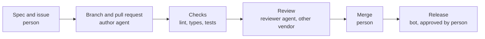

# Reply Assistant

A small service for a sales or support manager. It takes a customer message, reads a short knowledge base and returns two blocks: a polite reply for the customer and an upsell hint for the manager.

The repository has a second purpose. Every change after the bootstrap commit goes through a pipeline where agents write and review the code on GitHub, and a person decides what is merged. The pipeline, its limits and its instructions are part of the repository.

## Status

Bootstrap. The service starts and answers `GET /health`. Features arrive through issues, one pull request per issue. The specification is in [`specs/001-reply-and-upsell`](specs/001-reply-and-upsell/spec.md).

## How a change is made



| Step | Who | How it starts |
|---|---|---|
| Issue with acceptance criteria | Person | Issue template |
| Implementation | Author agent | The owner comments `/oc` on the issue |
| Checks | GitHub Actions | Every pull request |
| Review | Reviewer agent from a different vendor | The owner comments `@codex review` |
| Merge | Person | After green checks |

What agents may and may not do is described in [How this repository is built](docs/how-this-repo-is-built.md). The reasons behind the design are in [`docs/adr`](docs/adr).

## Run locally

Requires Python 3.12 and [uv](https://docs.astral.sh/uv/).

```bash
uv sync --locked
uv run reply-assistant
```

The service listens on `http://127.0.0.1:8000`.

## Checks

```bash
uv run ruff check .
uv run ruff format --check .
uv run mypy .
uv run pytest --cov
```

## Design in brief

- The knowledge base is a file. Replacing the file moves the assistant to another catalogue or another company without a code change.
- The knowledge base is short and goes into the model request whole. Retrieval is added when the knowledge base stops fitting.
- The model returns structured output by a schema. The schema guarantees the shape of the answer, and code checks the content: a suggested product must exist in the knowledge base, and a reply must not contain a health claim.
- The model client is an interface. Tests run without a network and without a key.

## Repository map

| Path | Content |
|---|---|
| `src/reply_assistant` | Service code |
| `tests` | Tests; `tests/acceptance` is written by the owner |
| `specs` | Specification, plan and tasks |
| `docs/adr` | Decision records |
| `AGENTS.md` | Instructions every agent reads |
| `.claude/skills` | Skills used by agents in this repository |
| `.github` | Workflows, templates, code owners |

## License

[MIT](LICENSE)
