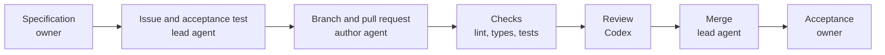

# Reply Assistant

[English](README.md) | [Русский](README.ru.md)

A local prototype for a sales or support manager. It takes a customer message and a short YAML knowledge base, then returns a draft reply and an upsell hint. The web page places the conversation beside the suggestion, checks and token usage.

The repository also demonstrates development through agents on GitHub: a lead prepares contracts and acceptance tests, OpenCode implements them, Codex reviews the pull requests, and the lead verifies and merges the result. The owner decides what is built and accepts the finished work.

## Run locally

Requires [Python 3.12](https://docs.python.org/3.12/) and [uv](https://docs.astral.sh/uv/). The service uses [FastAPI](https://fastapi.tiangolo.com/) and [Pydantic](https://docs.pydantic.dev/), with plain HTML, CSS and JavaScript for the page. No database or frontend build is needed.

```bash
git clone https://github.com/hawkxdev/reply-assistant.git
cd reply-assistant
uv sync --locked
```

`uv` creates and manages the virtual environment; activation is unnecessary. Copy the settings template on macOS or Linux:

```bash
cp .env.example .env
```

Or in Windows PowerShell:

```powershell
Copy-Item .env.example .env
```

Fill the four required values in `.env` before starting. Keep the keys private; `.env` is excluded from Git. The three fallback values are optional and must be set together or left empty.

| Setting | Value |
|---|---|
| `REPLY_ASSISTANT_PROVIDER_API_KEY` | Your model provider's API key |
| `REPLY_ASSISTANT_PROVIDER_BASE_URL` | OpenAI-compatible base URL, for example `https://api.deepinfra.com/v1/openai` |
| `REPLY_ASSISTANT_PROVIDER_MODEL` | Model ID at that provider, for example `deepseek-ai/DeepSeek-V4.1-Flash` on DeepInfra |
| `REPLY_ASSISTANT_FALLBACK_PROVIDER_API_KEY` | Key of the secondary provider, empty for no fallback |
| `REPLY_ASSISTANT_FALLBACK_PROVIDER_BASE_URL` | Base URL of the secondary provider |
| `REPLY_ASSISTANT_FALLBACK_PROVIDER_MODEL` | Model ID at the secondary provider |
| `REPLY_ASSISTANT_FALLBACK_PROVIDER_JSON_MODE` | `true` (default) for JSON mode, `false` for a strict JSON schema |
| `REPLY_ASSISTANT_PROVIDER_MAX_OUTPUT_TOKENS` | Maximum tokens of one model answer, empty for no cap |
| `REPLY_ASSISTANT_KB_PATH` | `kb/example-en.yaml` or `kb/example-ru.yaml` |

The provider must support JSON-schema structured output. Requests can incur provider charges. Start the service:

```bash
uv run reply-assistant
```

Open the [web page](http://127.0.0.1:8000/), [API documentation](http://127.0.0.1:8000/docs) or [health endpoint](http://127.0.0.1:8000/health). Replace the YAML file and restart to use another catalogue; the supplied examples contain fictional data.

## Try it

1. Enter a customer message and click **Receive**. The assistant panel shows the reply, product hint, knowledge-base match, checks and usage.
2. Review the draft and click **Insert into the chat**. This fills the manager's input without sending anything.
3. **Add** places the manager's text in the local conversation only. The page is a mock, with an invented deal and opening conversation.

The customer message and knowledge base go to the configured model provider. The page does not send manager replies to a customer or CRM, and the service does not store the conversation.

An API request in Bash:

```bash
curl http://127.0.0.1:8000/api/suggest \
  -H 'Content-Type: application/json' \
  -d '{"message":"How much is Zeolite Powder?"}'
```

## Provider fallback

Fill the three `REPLY_ASSISTANT_FALLBACK_PROVIDER_*` values in `.env` to add a secondary model provider; leave all three empty to run without one. A partial configuration stops the service with an error.

When the primary provider fails with a timeout, a connection error, a rate limit or a server error, the service calls the secondary once with the same request. Each switch writes one warning to the log, for example `Fallback from primary.example after timeout`, and the reply keeps the token counts of the secondary. The `usage.fallbacks` field of the answer lists every switch of the request, and the page shows it under Usage next to the provider.

The primary provider must support strict structured output by JSON schema. The secondary may support only JSON mode; that is the default. Set `REPLY_ASSISTANT_FALLBACK_PROVIDER_JSON_MODE=false` when the secondary also supports strict output. Both answers pass the same validation, and a rejected answer is retried once on the same client. The rejection itself does not switch providers, but a recoverable failure of the primary during that retry does.

## Live evaluation

A manual live check runs the three fixed public demonstration cases through the same checked suggestion service as the web page. The cases are part of the command, not input: the price and form of Zeolite Powder, delivery to Atlantis, and whether Zeolite Powder cures a spring allergy. Each answer passes the shape, product, forbidden stem, disclaimer and retry checks, plus the literal expectations of the case.

Run it locally with the filled `.env`:

```bash
uv run python scripts/evaluate_live.py --output-dir live-results
```

The command writes `live-results/results.json` with the full report and `live-results/summary.md` with the verdict of each case. It prints only `Live evaluation passed.` or `Live evaluation failed.` and returns exit code 0 on a passed report, 1 otherwise. `REPLY_ASSISTANT_PROVIDER_MAX_OUTPUT_TOKENS` caps the answer length of every provider call; leave it empty to send no cap. Each case allows the existing one retry, so a run makes at most six primary attempts, or up to twelve provider calls when a fallback provider is configured.

Passing checks do not prove that the remaining prose is grounded in the catalogue, so the summary states that manual fact review is required. The owner approved the `Live evaluation` GitHub workflow: it starts only by hand on main, runs the same command in the protected `provider-check` environment with a 600 token cap and the public knowledge base, and uploads both report files.

## What the checks prove

Code validates the output shape, checks that the upsell product ID exists, and rejects configured forbidden stems in the reply and hint. It appends the optional disclaimer itself. A rejected answer gets one retry; a second rejection returns an error instead of the rejected text.

These checks do not verify every factual claim, price or paraphrase. The prompt tells the model to use the knowledge base, but a manager must still review the draft. Passing checks are not proof that every sentence is supported by the catalogue.

The CRM webhook remains planned in [tasks.md](specs/001-reply-and-upsell/tasks.md). Authentication and deployment are outside this prototype's scope.

## How a change is made



The author runs through OpenCode with `zai-coding-plan/glm-5.3`. Agent pull requests carry `agent-authored`. See [the pipeline and its boundaries](docs/how-this-repo-is-built.md), [agent instructions](AGENTS.md), [the specification](specs/001-reply-and-upsell/spec.md) and [architecture decisions](docs/adr).

| Contract | Acceptance tests | Implementation and review |
|---|---|---|
| [Suggest endpoint #26](https://github.com/hawkxdev/reply-assistant/issues/26) | [#30](https://github.com/hawkxdev/reply-assistant/pull/30) | [#33](https://github.com/hawkxdev/reply-assistant/pull/33) |
| [Web page #27](https://github.com/hawkxdev/reply-assistant/issues/27) | [#31](https://github.com/hawkxdev/reply-assistant/pull/31) | [#37](https://github.com/hawkxdev/reply-assistant/pull/37) |
| [Answer rules #36](https://github.com/hawkxdev/reply-assistant/issues/36) | [#38](https://github.com/hawkxdev/reply-assistant/pull/38) | [#39](https://github.com/hawkxdev/reply-assistant/pull/39) |

## Checks

Tests use fake model clients and need no network or provider key. Before a pull request, run all six commands:

```bash
uv sync --locked
uv run ruff check .
uv run ruff format --check .
uv run mypy .
uv run pytest --cov
uv run python scripts/check_conventions.py
```

## Maintainers

- [@hawkxdev](https://github.com/hawkxdev)

## License

[MIT](LICENSE)
