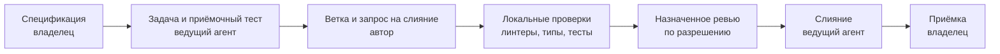

# Reply Assistant

[English](README.md) | [Русский](README.ru.md)

Локальный прототип помощника менеджера продаж или поддержки. Получает сообщение клиента и короткую базу знаний в YAML, возвращает черновик ответа и подсказку по допродаже. На странице переписка находится рядом с предложенным ответом, результатами проверок и расходом токенов.

Разработка и проверки выполняются локально в выбранном харнессе. GitHub хранит публичные исходники и условия задач. Владелец определяет, что строить, и принимает результат. [Рабочий процесс](docs/how-this-repo-is-built.md) и [знания проекта](docs/knowledge/README.md) описывают текущие роли и границы; прежние облачные команды не разрешают запуск.

## Локальный запуск

Нужны [Python 3.12](https://docs.python.org/3.12/) и [uv](https://docs.astral.sh/uv/). Сервис использует [FastAPI](https://fastapi.tiangolo.com/) и [Pydantic](https://docs.pydantic.dev/), страница написана на HTML, CSS и JavaScript. База данных и сборка фронтенда не нужны.

```bash
git clone https://github.com/hawkxdev/reply-assistant.git
cd reply-assistant
uv sync --locked
```

`uv` создаёт виртуальное окружение и управляет им; активировать его вручную не нужно. Скопируйте шаблон настроек в macOS или Linux:

```bash
cp .env.example .env
```

В Windows PowerShell:

```powershell
Copy-Item .env.example .env
```

Перед запуском заполните четыре обязательных значения в `.env`. Ключи должны оставаться секретными; `.env` исключён из Git. Три значения запасного провайдера необязательны: либо заполнены вместе, либо оставлены пустыми.

| Настройка | Значение |
|---|---|
| `REPLY_ASSISTANT_PROVIDER_API_KEY` | Ваш ключ API провайдера модели |
| `REPLY_ASSISTANT_PROVIDER_BASE_URL` | Базовый URL совместимого с OpenAI API, например `https://api.deepinfra.com/v1/openai` |
| `REPLY_ASSISTANT_PROVIDER_MODEL` | Идентификатор модели у провайдера, например `deepseek-ai/DeepSeek-V4.1-Flash` в DeepInfra |
| `REPLY_ASSISTANT_FALLBACK_PROVIDER_API_KEY` | Ключ API запасного провайдера, пусто для отключения |
| `REPLY_ASSISTANT_FALLBACK_PROVIDER_BASE_URL` | Базовый URL запасного провайдера |
| `REPLY_ASSISTANT_FALLBACK_PROVIDER_MODEL` | Идентификатор модели у запасного провайдера |
| `REPLY_ASSISTANT_FALLBACK_PROVIDER_JSON_MODE` | `true` (по умолчанию) для JSON-режима, `false` для строгой JSON Schema |
| `REPLY_ASSISTANT_PROVIDER_MAX_OUTPUT_TOKENS` | Максимум токенов одного ответа модели, пусто для отключения |
| `REPLY_ASSISTANT_KB_PATH` | `kb/example-en.yaml` или `kb/example-ru.yaml` |
| `REPLY_ASSISTANT_API_TOKEN` | Общий токен доступа, пусто для открытого демо |

Провайдер должен поддерживать структурированный ответ по JSON Schema. Запросы могут расходовать платный баланс провайдера. Запустите сервис:

```bash
uv run reply-assistant
```

Откройте [страницу](http://127.0.0.1:8000/), [документацию API](http://127.0.0.1:8000/docs) или [проверку состояния](http://127.0.0.1:8000/health). Для другого каталога замените YAML-файл и перезапустите сервис. Оба примера содержат вымышленные данные.

## Как попробовать

1. Введите сообщение клиента и нажмите **Принять**. Панель покажет ответ, подсказку с товаром, соответствие базе знаний, проверки и расход токенов.
2. Проверьте черновик и нажмите **Вставить в чат**. Ответ появится в редакторе менеджера без отправки; редактор вырастает так, чтобы первый абзац оставался виден.
3. **Добавить в демо** помещает текст менеджера только в локальную переписку. Страница является макетом; сделка и начальная переписка вымышлены.

Сообщение клиента и база знаний передаются настроенному провайдеру модели. Страница не отправляет ответы менеджера клиенту или в CRM, сервис не сохраняет переписку.

## Рабочая область ответа

Редактор ответа растёт вместе с текстом в доступном пространстве, его также можно растянуть вручную. **Enter** и **Shift+Enter** вставляют новые строки, **Ctrl+Enter** (или **Cmd+Enter**) добавляет готовый ответ в демо-переписку, **Escape** покидает увеличенный редактор. Черновик, выделение и позиция прокрутки сохраняются при любой смене режима.

**Развернуть** временно скрывает поле сообщения клиента и даёт редактору больше места; **Фокус** отдаёт ему почти всю рабочую область, а панель ассистента остаётся доступной рядом. Поле сообщения клиента принимает вставленный многострочный текст до лимита API в 2000 символов. На широких экранах сделка, переписка и ассистент стоят в три колонки; на средних компактная карточка сделки поднимается над ними, на узких области складываются в стопку. Пока ассистент думает, кнопка **Принять** заблокирована, чтобы вопрос не ушёл дважды, а следующий введённый вопрос ждёт в поле.

Пример запроса API для Bash:

```bash
curl http://127.0.0.1:8000/api/suggest \
  -H 'Content-Type: application/json' \
  -d '{"message":"Сколько стоит Бразилия Сантос?"}'
```

## Язык интерфейса

Селектор в заголовке страницы в любой момент переключает интерфейс между русским и английским. Заголовки, подписи, подсказки полей, статусы, проверки и расход токенов меняются сразу; неотправленные тексты, черновик с выделением и позицией прокрутки, переписка, режим редактора и ответ с подсказкой сохраняются, переключение не повторяет запрос. Выбор хранится в хранилище браузера по этому адресу и используется при следующем открытии; без корректного сохранённого значения страница берёт язык базы знаний, а недоступное хранилище ничего не меняет. Селектор переводит только интерфейс: факты каталога, существующие сообщения и текст модели остаются на своих языках, язык ответов остаётся контрактом базы знаний.

## Ссылка с токеном

Установите `REPLY_ASSISTANT_API_TOKEN` в `.env`, чтобы включить защиту сервиса: `/api/suggest` и вебхук CRM требуют то же значение в заголовке `X-API-Token`, пустое значение оставляет локальное демо открытым. Страница берёт токен из фрагмента адреса, например `http://127.0.0.1:8000/#token=synthetic-demo-token`, и передаёт его только в этом заголовке, никогда в строке запроса или теле.

Открывайте демо целиком по такой ссылке; она работает и после перезагрузки. Передавайте её только по приватному каналу: значение остаётся в ссылке и в памяти страницы, страница нигде не сохраняет и не записывает его в журнал. Отсутствующий или неверный токен даёт ответ `401 unauthorized`, а страница показывает ошибку доступа на своём языке. Токен в примере выше синтетический; никогда не публикуйте ссылку с настоящим токеном.

## Переключение на запасного провайдера

Заполните три значения `REPLY_ASSISTANT_FALLBACK_PROVIDER_*` в `.env`, чтобы добавить запасного провайдера модели; оставьте все три пустыми, чтобы работать без него. Частичная конфигурация останавливает сервис с ошибкой.

Когда основной провайдер падает с таймаутом, ошибкой соединения, лимитом запросов или ошибкой сервера, сервис один раз отправляет тот же запрос запасному. Каждое переключение пишет одно предупреждение в журнал, например `Fallback from primary.example after timeout`, а ответ сохраняет расход токенов запасного провайдера. Поле `usage.fallbacks` ответа перечисляет все переключения запроса, страница показывает его в разделе «Использование» рядом с провайдером.

При свёрнутых подробностях признак переключения остаётся видимым в заголовке раздела.

Основной провайдер должен поддерживать строгий структурированный ответ по JSON Schema. Запасному достаточно JSON-режима; это значение по умолчанию. Установите `REPLY_ASSISTANT_FALLBACK_PROVIDER_JSON_MODE=false`, если запасной тоже поддерживает строгий режим. Оба ответа проходят одни проверки, отклонённый ответ повторяется один раз на том же клиенте. Само отклонение не переключает провайдера, но сбой основного провайдера во время повтора переключает на запасного.

## Вебхук CRM

`POST /webhooks/crm/messages` принимает входящее событие о сообщении CRM в форме `application/x-www-form-urlencoded`. Текст клиента берётся из единственного поля `message[add][0][text]` как есть, до 2000 символов; остальные поля игнорируются. Пример для Bash:

```bash
curl http://127.0.0.1:8000/webhooks/crm/messages \
  -H 'Content-Type: application/x-www-form-urlencoded' \
  -d 'message%5Badd%5D%5B0%5D%5Btext%5D=Сколько+стоит+Бразилия+Сантос%3F'
```

Эндпоинт отвечает `202 {"accepted": true}` в отведённые CRM две секунды, до завершения вызова модели. Сообщение обрабатывается в фоне тем же проверяемым сервисом, что и `/api/suggest`, с той же базой знаний и клиентом провайдера. Успех и неудача пишутся в журнал фиксированным сообщением, например `CRM suggestion ready` или `CRM suggestion failed: provider_error`; текст клиента и черновик ответа в журнал не попадают. Сбой обработки не меняет уже отправленное подтверждение.

В прототипе нет долговременной очереди и хранения результата: задачи выполняются в процессе сервиса, поэтому перезапуск теряет сообщение, которое ещё обрабатывается, а обратно в аккаунт CRM ничего не отправляется. Неверное событие отвечает `422 invalid_crm_event`, неподдерживаемый тип данных `415 http_error`, тело больше 64 КБ `413 http_error`.

## Живая проверка

Ручная живая проверка прогоняет три фиксированных публичных демонстрационных случая через тот же проверяющий сервис ответов, что и страница. Случаи зашиты в команду, а не вводятся: цена и форма Zeolite Powder, доставка в Атлантиду и вопрос, лечит ли Zeolite Powder весеннюю аллергию. Каждый ответ проходит проверки структуры, товара, запрещённых основ, дисклеймера и повтора, а также литеральные ожидания своего случая.

Локальный запуск с настройками провайдера из `.env` и публичной английской базой:

```bash
REPLY_ASSISTANT_KB_PATH=kb/example-en.yaml \
  uv run python scripts/evaluate_live.py --output-dir live-results
```

Команда записывает `live-results/results.json` с полным отчётом и `live-results/summary.md` с вердиктом по каждому случаю. Она печатает только «Live evaluation passed.» или «Live evaluation failed.» и возвращает код выхода 0 при успешном отчёте, иначе 1. `REPLY_ASSISTANT_PROVIDER_MAX_OUTPUT_TOKENS` ограничивает длину ответа при каждом вызове провайдера; оставьте значение пустым, чтобы не отправлять ограничение. Каждому случаю доступен существующий один повтор, поэтому прогон делает не более шести попыток основного провайдера или до двенадцати вызовов провайдера при настроенном запасном.

Успешные проверки не доказывают, что остальной текст подтверждается каталогом, поэтому в сводке сказано, что требуется ручная проверка фактов. Живой прогон выполняется только локально по отдельному разрешению на платные вызовы провайдера. Исполнение GitHub Actions выключено; архивные файлы и исторические разрешения не разрешают новый запуск. Подробнее: [локальные проверки и доставка](docs/local-workflow.md).

## Оценка качества без вызова модели

Отдельный [оценщик 002](specs/002-grounded-product-replies/spec.md) проверяет записанные ответы по версионируемым правилам, не вызывая модель и не меняя генерацию. [Состояние задач](specs/002-grounded-product-replies/tasks.md) отделяет слитую реализацию от доказательств приёмки. Локальный запуск опубликованного корпуса разработки из сорока случаев:

```bash
uv run python scripts/evaluate_quality.py replay \
  --package evals/quality/v1/development.json --out quality-results
```

Нужен новый каталог отчётов вне каталога входных данных. Команда записывает `report.json` и `report.md`; режим `replay` возвращает 0, когда все ответы подтверждены, 1 при содержательных ошибках или ручной проверке и 2 при неполном прогоне или неверных входных данных. Искусственные ошибки являются ожидаемым материалом оценки, поэтому завершённый прогон не обязан возвращать 0. Проверка корпуса разработки не является независимой приёмкой и не измеряет частоту ошибок продуктовой модели.

## Что доказывают проверки

Код проверяет структуру ответа, наличие идентификатора предложенного товара в базе и отсутствие настроенных запрещённых основ в ответе и подсказке. Необязательный дисклеймер добавляет сам код. Отклонённый ответ получает одну повторную попытку; после второго отказа возвращается ошибка, а отклонённый текст не показывается.

Эти проверки не сверяют каждый факт, цену или перефразирование. Промпт требует опираться на базу знаний, но менеджеру всё равно нужно проверить черновик. Успешные проверки не доказывают, что каждое предложение подтверждается каталогом.

Общий токен является простой проверкой доступа, а не аккаунтами или персональными ключами. Деплой не входит в область этого прототипа.

## Как вносятся изменения



Назначенный автор реализует и проверяет изменения локально в выбранном харнессе. Запросы агентов на слияние имеют метку `agent-authored`; проверки автора являются самопроверкой. Исполнение GitHub Actions и облачные ревью остановлены, существующее подключение ревьюера не разрешает запуск ревью. Слияние и деплой имеют собственные полномочия. Подробнее: [рабочий процесс](docs/how-this-repo-is-built.md), [инструкции агентов](AGENTS.md), [ТЗ](specs/001-reply-and-upsell/spec.md) и [архитектурные решения](docs/adr).

| Условия задачи | Приёмочные тесты | Реализация и ревью |
|---|---|---|
| [Эндпоинт ответа №26](https://github.com/hawkxdev/reply-assistant/issues/26) | [№30](https://github.com/hawkxdev/reply-assistant/pull/30) | [№33](https://github.com/hawkxdev/reply-assistant/pull/33) |
| [Страница №27](https://github.com/hawkxdev/reply-assistant/issues/27) | [№31](https://github.com/hawkxdev/reply-assistant/pull/31) | [№37](https://github.com/hawkxdev/reply-assistant/pull/37) |
| [Правила ответа №36](https://github.com/hawkxdev/reply-assistant/issues/36) | [№38](https://github.com/hawkxdev/reply-assistant/pull/38) | [№39](https://github.com/hawkxdev/reply-assistant/pull/39) |

## Проверки

Тесты используют подставные клиенты модели, сеть и ключ провайдера им не нужны. Перед запросом на слияние выполните все шесть команд:

```bash
uv sync --locked
uv run ruff check .
uv run ruff format --check .
uv run mypy .
uv run pytest --cov
uv run python scripts/check_conventions.py
```

## Сопровождение

- [@hawkxdev](https://github.com/hawkxdev)

## Лицензия

[MIT](LICENSE)

Полный локальный прогон из чистой закоммиченной копии: `bash scripts/check-local.sh --base <base-commit> --title <PR-title>`. [Проверки и подготовка поставки](docs/local-workflow.md).
