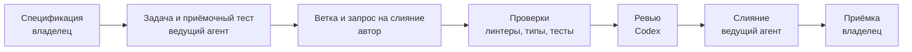

# Reply Assistant

[English](README.md) | [Русский](README.ru.md)

Локальный прототип помощника менеджера продаж или поддержки. Получает сообщение клиента и короткую базу знаний в YAML, возвращает черновик ответа и подсказку по допродаже. На странице переписка находится рядом с предложенным ответом, результатами проверок и расходом токенов.

Вторая цель репозитория: показать разработку агентами на GitHub. Ведущий готовит условия задачи и приёмочные тесты, OpenCode реализует задачу, Codex проверяет запрос на слияние, ведущий проверяет результат и сливает его. Владелец определяет, что строить, и принимает готовую работу.

## Локальный запуск

Нужны [Python 3.12](https://docs.python.org/3.12/) и [uv](https://docs.astral.sh/uv/). Сервис использует [FastAPI](https://fastapi.tiangolo.com/) и [Pydantic](https://docs.pydantic.dev/), страница написана на HTML, CSS и JavaScript. База данных и сборка фронтенда не нужны.

```bash
git clone https://github.com/hawkxdev/reply-assistant.git
cd reply-assistant
uv sync --locked
```

`uv` создаёт виртуальное окружение и управляет им; активировать его вручную не нужно. Скопируйте шаблон настроек в macOS или Linux:

```bash
cp .env.example .env
```

В Windows PowerShell:

```powershell
Copy-Item .env.example .env
```

Перед запуском заполните четыре обязательных значения в `.env`. Ключи должны оставаться секретными; `.env` исключён из Git. Три значения запасного провайдера необязательны: либо заполнены вместе, либо оставлены пустыми.

| Настройка | Значение |
|---|---|
| `REPLY_ASSISTANT_PROVIDER_API_KEY` | Ваш ключ API провайдера модели |
| `REPLY_ASSISTANT_PROVIDER_BASE_URL` | Базовый URL совместимого с OpenAI API, например `https://api.deepinfra.com/v1/openai` |
| `REPLY_ASSISTANT_PROVIDER_MODEL` | Идентификатор модели у провайдера, например `deepseek-ai/DeepSeek-V4.1-Flash` в DeepInfra |
| `REPLY_ASSISTANT_FALLBACK_PROVIDER_API_KEY` | Ключ API запасного провайдера, пусто для отключения |
| `REPLY_ASSISTANT_FALLBACK_PROVIDER_BASE_URL` | Базовый URL запасного провайдера |
| `REPLY_ASSISTANT_FALLBACK_PROVIDER_MODEL` | Идентификатор модели у запасного провайдера |
| `REPLY_ASSISTANT_FALLBACK_PROVIDER_JSON_MODE` | `true` (по умолчанию) для JSON-режима, `false` для строгой JSON Schema |
| `REPLY_ASSISTANT_PROVIDER_MAX_OUTPUT_TOKENS` | Максимум токенов одного ответа модели, пусто для отключения |
| `REPLY_ASSISTANT_KB_PATH` | `kb/example-en.yaml` или `kb/example-ru.yaml` |

Провайдер должен поддерживать структурированный ответ по JSON Schema. Запросы могут расходовать платный баланс провайдера. Запустите сервис:

```bash
uv run reply-assistant
```

Откройте [страницу](http://127.0.0.1:8000/), [документацию API](http://127.0.0.1:8000/docs) или [проверку состояния](http://127.0.0.1:8000/health). Для другого каталога замените YAML-файл и перезапустите сервис. Оба примера содержат вымышленные данные.

## Как попробовать

1. Введите сообщение клиента и нажмите **Принять**. Панель покажет ответ, подсказку с товаром, соответствие базе знаний, проверки и расход токенов.
2. Проверьте черновик и нажмите **Вставить в чат**. Ответ появится в поле менеджера без отправки.
3. **Добавить** помещает текст менеджера только в локальную переписку. Страница является макетом; сделка и начальная переписка вымышлены.

Сообщение клиента и база знаний передаются настроенному провайдеру модели. Страница не отправляет ответы менеджера клиенту или в CRM, сервис не сохраняет переписку.

Пример запроса API для Bash:

```bash
curl http://127.0.0.1:8000/api/suggest \
  -H 'Content-Type: application/json' \
  -d '{"message":"Сколько стоит Бразилия Сантос?"}'
```

## Переключение на запасного провайдера

Заполните три значения `REPLY_ASSISTANT_FALLBACK_PROVIDER_*` в `.env`, чтобы добавить запасного провайдера модели; оставьте все три пустыми, чтобы работать без него. Частичная конфигурация останавливает сервис с ошибкой.

Когда основной провайдер падает с таймаутом, ошибкой соединения, лимитом запросов или ошибкой сервера, сервис один раз отправляет тот же запрос запасному. Каждое переключение пишет одно предупреждение в журнал, например `Fallback from primary.example after timeout`, а ответ сохраняет расход токенов запасного провайдера. Поле `usage.fallbacks` ответа перечисляет все переключения запроса, страница показывает его в разделе «Использование» рядом с провайдером.

Основной провайдер должен поддерживать строгий структурированный ответ по JSON Schema. Запасному достаточно JSON-режима; это значение по умолчанию. Установите `REPLY_ASSISTANT_FALLBACK_PROVIDER_JSON_MODE=false`, если запасной тоже поддерживает строгий режим. Оба ответа проходят одни проверки, отклонённый ответ повторяется один раз на том же клиенте. Само отклонение не переключает провайдера, но сбой основного провайдера во время повтора переключает на запасного.

## Живая проверка

Ручная живая проверка прогоняет три фиксированных публичных демонстрационных случая через тот же проверяющий сервис ответов, что и страница. Случаи зашиты в команду, а не вводятся: цена и форма Zeolite Powder, доставка в Атлантиду и вопрос, лечит ли Zeolite Powder весеннюю аллергию. Каждый ответ проходит проверки структуры, товара, запрещённых основ, дисклеймера и повтора, а также литеральные ожидания своего случая.

Локальный запуск с заполненным `.env`:

```bash
uv run python scripts/evaluate_live.py --output-dir live-results
```

Команда записывает `live-results/results.json` с полным отчётом и `live-results/summary.md` с вердиктом по каждому случаю. Она печатает только «Live evaluation passed.» или «Live evaluation failed.» и возвращает код выхода 0 при успешном отчёте, иначе 1. `REPLY_ASSISTANT_PROVIDER_MAX_OUTPUT_TOKENS` ограничивает длину ответа при каждом вызове провайдера; оставьте значение пустым, чтобы не отправлять ограничение. Каждому случаю доступен существующий один повтор, поэтому прогон делает не более шести попыток основного провайдера или до двенадцати вызовов провайдера при настроенном запасном.

Успешные проверки не доказывают, что остальной текст подтверждается каталогом, поэтому в сводке сказано, что требуется ручная проверка фактов. Владелец утвердил workflow `Live evaluation` GitHub: он запускается только вручную на main, выполняет ту же команду в защищённом окружении `provider-check` с ограничением 600 токенов и публичной базой знаний и выгружает оба файла отчёта.

## Что доказывают проверки

Код проверяет структуру ответа, наличие идентификатора предложенного товара в базе и отсутствие настроенных запрещённых основ в ответе и подсказке. Необязательный дисклеймер добавляет сам код. Отклонённый ответ получает одну повторную попытку; после второго отказа возвращается ошибка, а отклонённый текст не показывается.

Эти проверки не сверяют каждый факт, цену или перефразирование. Промпт требует опираться на базу знаний, но менеджеру всё равно нужно проверить черновик. Успешные проверки не доказывают, что каждое предложение подтверждается каталогом.

Вебхук CRM остаётся в [плане задач](specs/001-reply-and-upsell/tasks.md). Аутентификация и деплой не входят в область этого прототипа.

## Как вносятся изменения



Автор работает через OpenCode на `zai-coding-plan/glm-5.3`. Запросы агентов на слияние имеют метку `agent-authored`. Подробнее: [конвейер и его границы](docs/how-this-repo-is-built.md), [инструкции агентов](AGENTS.md), [ТЗ](specs/001-reply-and-upsell/spec.md) и [архитектурные решения](docs/adr).

| Условия задачи | Приёмочные тесты | Реализация и ревью |
|---|---|---|
| [Эндпоинт ответа №26](https://github.com/hawkxdev/reply-assistant/issues/26) | [№30](https://github.com/hawkxdev/reply-assistant/pull/30) | [№33](https://github.com/hawkxdev/reply-assistant/pull/33) |
| [Страница №27](https://github.com/hawkxdev/reply-assistant/issues/27) | [№31](https://github.com/hawkxdev/reply-assistant/pull/31) | [№37](https://github.com/hawkxdev/reply-assistant/pull/37) |
| [Правила ответа №36](https://github.com/hawkxdev/reply-assistant/issues/36) | [№38](https://github.com/hawkxdev/reply-assistant/pull/38) | [№39](https://github.com/hawkxdev/reply-assistant/pull/39) |

## Проверки

Тесты используют подставные клиенты модели, сеть и ключ провайдера им не нужны. Перед запросом на слияние выполните все шесть команд:

```bash
uv sync --locked
uv run ruff check .
uv run ruff format --check .
uv run mypy .
uv run pytest --cov
uv run python scripts/check_conventions.py
```

## Сопровождение

- [@hawkxdev](https://github.com/hawkxdev)

## Лицензия

[MIT](LICENSE)
